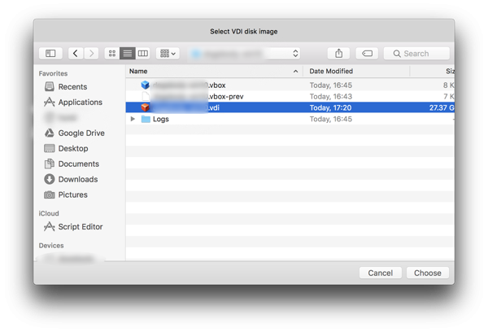
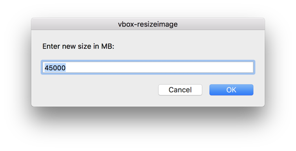
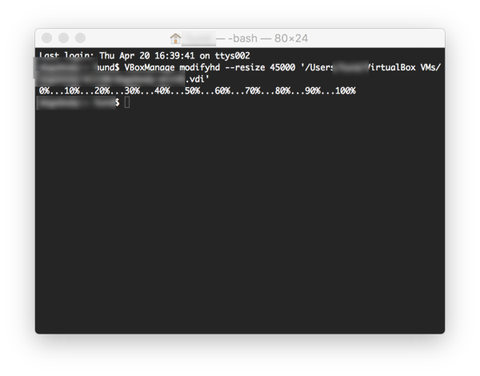

# vbox-resizeimage

AppleScript to assist resizing VirtualBox VDI image. Download and run from AppleScript Editor.

The current size will be shown below. Enter a new value.

VBoxManage command is then executed in terminal.

